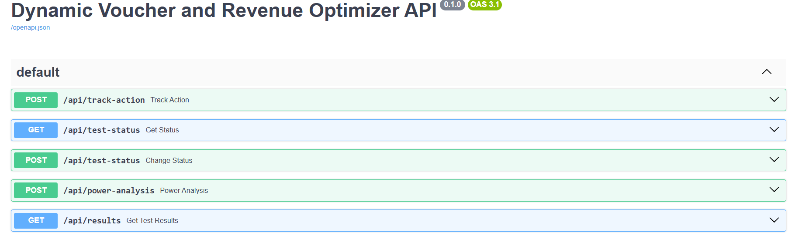

# Dynamic Voucher & Revenue Optimizer 

A/B testing pipeline and simulation engine designed to evaluate e-commerce campaign performances. This project simulates real-time user traffic, processes it through a robust backend, and calculates statistically significant results using both Frequentist and Bayesian methods.

## Project Overview
The goal of this project is to determine the most profitable campaign strategy for an e-commerce platform by comparing two variations:
* **Group A (Control):** %10 Discount Coupon
* **Group B (Variant):** Free Shipping on orders over 500 TL

To prove the pipeline works, a custom simulator generates fake user traffic where **Group B is intentionally biased** to perform better, allowing the statistical engine to detect the winner in real-time.

## Tech Stack & Architecture
* **Database:** PostgreSQL (DBeaver)
* **Backend Framework:** FastAPI
* **Data Science & Math:** Python, SciPy, Statsmodels, NumPy
* **Simulation:** Faker
* **Testing:** Jupyter Notebook (`research.ipynb`) & Swagger UI

## Core Features & Statistical Engine
Before launching the test, an **A-Priori Power Analysis (MDE)** was conducted in `research.ipynb` to determine the minimum required sample size for statistically valid results.

The real-time data flows into PostgreSQL via SQL queries executed in Python. The FastAPI endpoints then trigger the analytical engine to calculate:
1.  **Sample Ratio Mismatch (SRM):** Ensures traffic is fairly distributed (50/50) between groups.
2.  **Chi-Square Test:** Evaluates the significance of the Conversion Rates (CR).
3.  **Welch's T-Test:** Analyzes the Average Order Value (AOV) differences.
4.  **Confidence Intervals (CI):** Calculates the 95% certainty bounds for current metrics.
5.  **Bayesian A/B Testing:** A modern approach utilizing Beta Distributions and Monte Carlo simulations to provide intuitive business metrics.

## API & Swagger UI
The entire pipeline, including the test status controller and results generator, is fully accessible and tested via FastAPI's interactive Swagger UI.

## How to Run
1. Clone the repository.
2. Create a `.env` file with your PostgreSQL credentials.
3. Run the API: `uvicorn api.main:app --reload`
4. Run the simulator in a separate terminal: `python src/simulator.py`
5. Visit `http://localhost:8000/docs` to control the test and view live results.